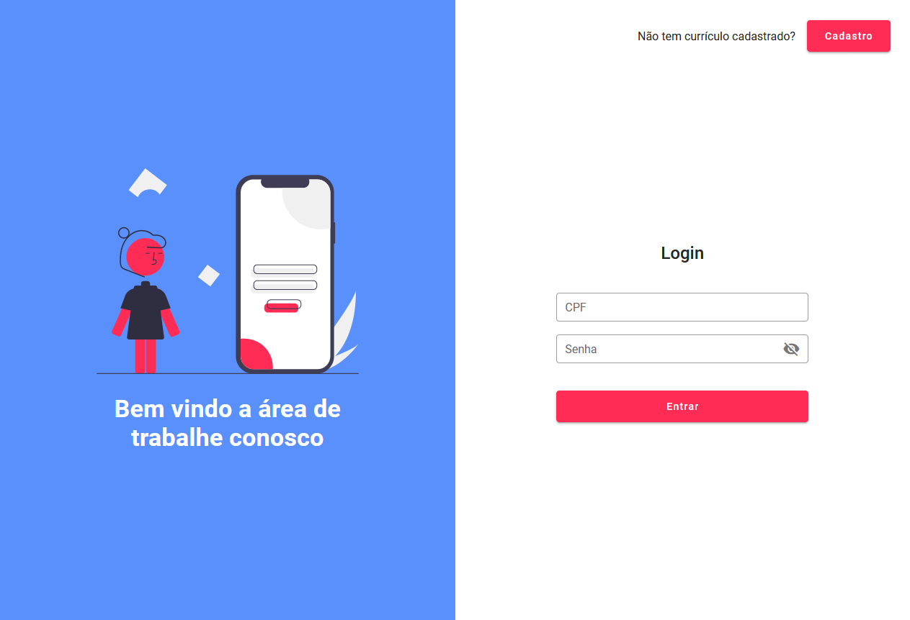
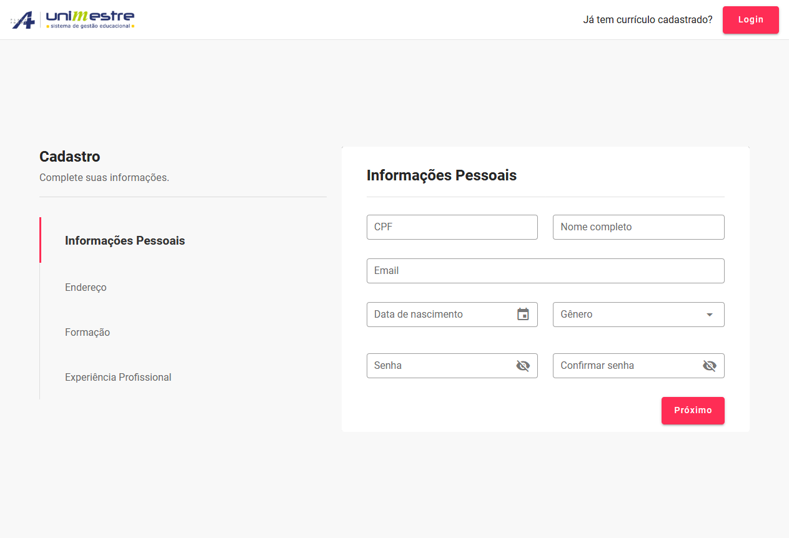

<h1 align="center">Unimestre Teste Técnico</h1>

<p align="center">Cadastro de currículo desenvolvido como desafio técnico</p>

<p align="center">
 <a href="#aplicação">Aplicação</a> • 
 <a href="#layout">Layout</a> • 
 <a href="#pré-requisitos">Pré-requisitos</a> • 
 <a href="#utilização">Utilização</a> •
 <a href="#endpoints">Endpoints</a> •
 <a href="#tecnologias">Tecnologias</a> •  
 <a href="#autor">Autor</a>
</p>

### Aplicação

#### Home

<p align="center">
  
</p>

#### Cadastro/Edição Informações

<p align="center">
  
</p>

### Pré-requisitos

Antes de começar, você vai precisar ter instalado em sua máquina as seguintes ferramentas:
[Git](https://git-scm.com), [XAMP](https://www.apachefriends.org/pt_br/index.html) (Apache, MySQL).
Além disto é bom ter um editor para trabalhar com o código como [VSCode](https://code.visualstudio.com/)

### Layout

[Referência Página Home](https://assets.materialup.com/uploads/128a1310-4985-4ea1-8c03-ffab3b1d13ba/preview.png)
[Referência Página Cadastro/Edição Informações](https://i.pinimg.com/originals/e6/52/f6/e652f6ae4a5dfb1c6d8cece30493a812.gif)

### Utilização

#### Clonando o repositório

```bash
# Clone este repositório
$ git clone https://github.com/vduggen/unimestre-teste.git

# Acesse a pasta do projeto no terminal/cmd
$ cd unimestre-teste

```

#### Backend

##### Instalando as dependências

```bash
Mova a pasta backend para htdocs e renomeie para unimestre-backend

Abra o XAMP e inicie o Apache e MySQL
```

#### Banco de dados

##### Criando banco de dados

```bash
# https://www.heidisql.com/download.php
Instale o HeidiSQL

Entre na pasta db e clique 2x no arquivo db.sql

Logo após aperte a tecla F9
```

#### Frontend

##### Instalando as dependências

```bash
# Acesse a pasta da aplicação
$ cd frontend

# Instale as dependências
$ npm install ou yarn install
```

##### Iniciando a aplicação

```bash
# Execute a aplicação
$ yarn start

# A aplicação inciará na porta:8080
```

### Endpoints

##### Usuário

- **PUT**: `/users/api/users.php` - Edição
- **POST**: `/users/api/users.php` - Criação

##### Endereço

- **GET**: `/clients/api/address.php` - Listagem
- **PUT**: `/clients/api/address.php` - Edição
- **POST**: `/clients/api/address.php` - Criação

##### Experiência

- **GET**: `/clients/api/experience.php` - Listagem
- **PUT**: `/clients/api/experience.php` - Edição
- **POST**: `/clients/api/experience.php` - Criação
- **DELETE**: `/clients/api/experience.php` - Exclusão

##### Formação

- **GET**: `/clients/api/graduation.php` - Listagem
- **PUT**: `/clients/api/graduation.php` - Edição
- **POST**: `/clients/api/graduation.php` - Criação
- **DELETE**: `/clients/api/graduation.php` - Exclusão

##### Pessoa

- **GET**: `/clients/api/person.php` - Listagem
- **PUT**: `/clients/api/person.php` - Edição
- **POST**: `/clients/api/person.php` - Criação

### Tecnologias

- [VueJS](https://vuejs.org/)
- [Vuetify](https://vuetifyjs.com/)
- [PHP](https://www.php.net/)
- [MySQL](https://mysql.com/)

### Autor

  

[Vitor Luiz Duggen](https://github.com/vduggen)

Feito com ❤️ por Vitor Luiz Duggen!

  <a href="https://github.com/vduggen" alt="GitHub">
    
  </a>
  <a href="https://www.linkedin.com/in/vitor-duggen-257198197/" alt="LinkedIn">
    
  </a>
  <a href="mailto:zduggem@gmail.com" alt="Gmail">
    
  </a>
